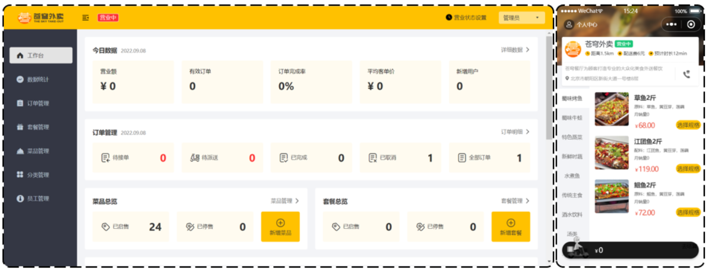
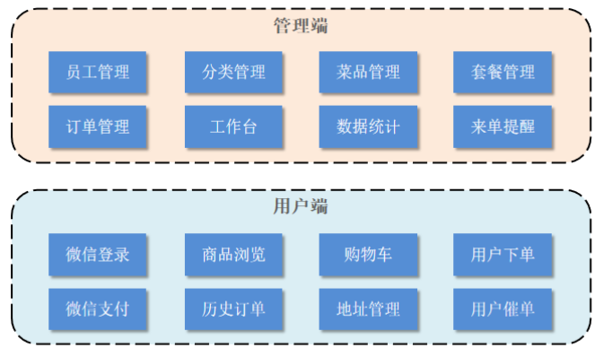
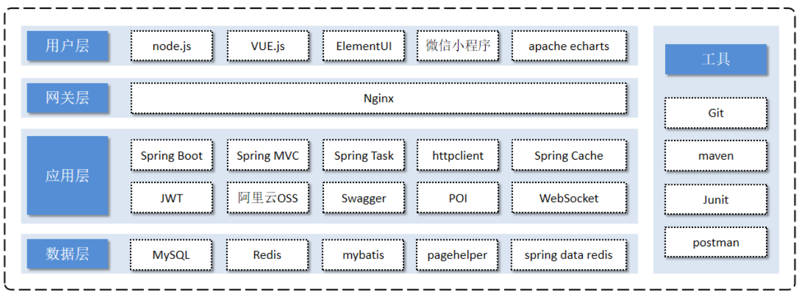
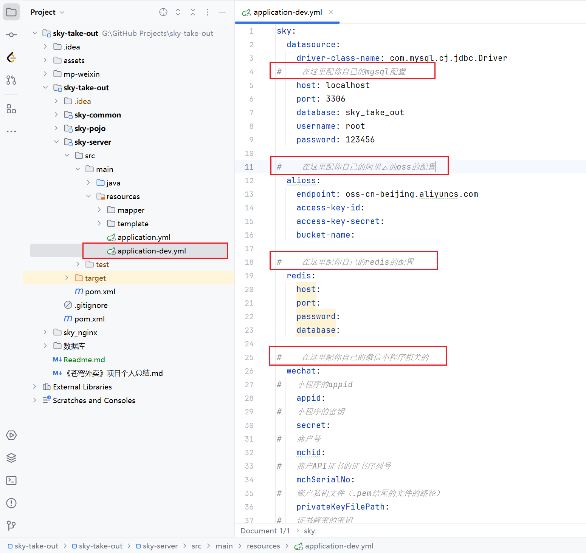

# 苍穹外卖

## 项目介绍

本项目（苍穹外卖）是专门为餐饮企业（餐厅、饭店）定制的一款软件产品，包括 系统管理后台 和 小程序端应用 两部分。其中系统管理后台主要提供给餐饮企业内部员工使用，可以对餐厅的分类、菜品、套餐、订单、员工等进行管理维护，对餐厅的各类数据进行统计，同时也可进行来单语音播报功能。小程序端主要提供给消费者使用，可以在线浏览菜品、添加购物车、下单、支付、催单等。

功能架构图：展示**管理端**和**用户端**的具体业务功能模块。

技术选型：

## 项目启动

1. 在自己的本地数据库中运行“数据库”文件夹中的sql文件
2. 开启Nginx（运行nginx.exe），个人配置的nginx启动端口为90，即需要在浏览器输入localhost:90来打开前端页面
3. 在项目的application-dev.yml文件中配置自己的相关配置，配置完后启动项目（运行SkyApplication）
4. 在浏览器输入localhost:90来打开系统管理后台
5. 在微信开发者工具中打开“mp-weixin”文件夹即可启动小程序端应用

## 个人总结

1. 员工登录后需要对密码进行md5加密，然后再进行比对

2. 新增员工时可能会出现录入的用户名已存，抛出的异常后没有处理，通过全局异常处理器来处理（@ExceptionHandler）

3. 利用PageHelper实现分页查询

4. 使用用户登录后传入jwt，以后每次发出请求都携带token并用拦截器进行校验，并且新增员工时，创建人id和修改人id可以在拦截器中将用户id存储到ThreadLocal中，然后在调用新增员工的save方法时可以直接从ThreadLocal中获取id然后封装到对象中

5. 使用自定义AutoFill注解，为mapper中的insert、update操作中需传入的employee参数中的公共字段如CreateTime、UpdateTime等公共字段自动填充（使用了AOP切面编程）

6. 使用阿里Oss实现文件上传(菜品图片)

7. 设置店铺营业状态时使用redis的java客户端SpringDataRedis对营业状态进行操作

8. 在微信用户登录模块使用HttpClient向微信官方接口服务发送请求携带appId+appsecret+code三个参数，然后接收微信接口服务返回的数据，session_key+opendId等

9. 用户端小程序展示的菜品数据都是通过查询数据库获得，如果用户端访问量比较大，数据库访问压力随之增大，因此使用redis存储（先查redis有没有数据，有则直接返回，没有则查询数据库，并将查询到的数据存入redis），但在管理端dishController模块中的新增菜品、修改菜品、批量删除菜品、起售停售菜品时需要及时删除缓存数据，以防拿到redis中过时的数据

10. 使用了SpringCache技术，使用注解简单的实现了9中的技术：在用户端的SetmealController中的list方法上加@Cacheable注解，管理端的SetmealController中的save、delete、update、startOrStop方法上加@Cache 注解

11. 使用Cpolar内网穿透将本地localhost加到公网上，微信支付回调相关接口

12. 调用百度地图相关接口来检测收货地址是否超出配送范围

13. 使用SpringTask及Cron表达式对订单状态定时处理(处理超时未支付订单、过定时任务每天凌晨1点检查一次是否存在“派送中”的订单，如果存在则修改订单状态为“已完成”)进行到时任务自动触发

14. 使用WebSocket将浏览器与服务器建立起长连接（实时通信），当用户支付成功时通过WebSocket实现来单提醒（简单实现，未调用微信官方接口）、客户催单功能

15. 使用Apache ECharts 进行数据可视化（如营业额数据统计图表）

16. 使用Apache POI 将运营数据导出至Excel表格中

    